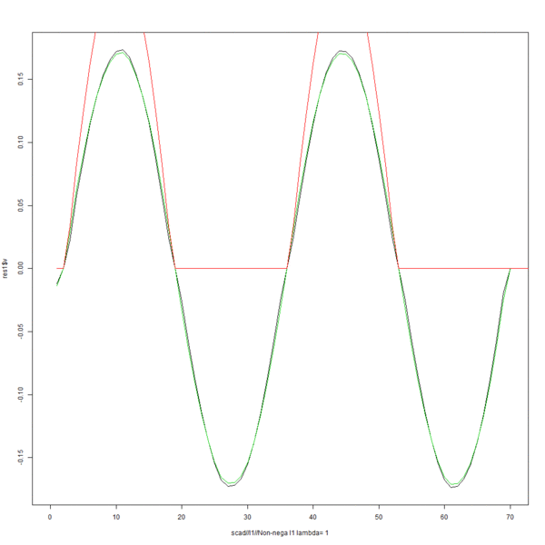

# MoMA Prototype demo

The following gif shows three different penalties, L1(black), SCAD(green) and non-negativity L1 (red) effects on the recovered signal with varying lambda.

Source code will be posted soon.



```R
for(l in seq(1,10,0.5)){
  l1 <- sfpca("PCA",
                  X=X,
                  Y=NULL,
                  Omega_u=O_u,Omega_v=O_v,
                  alpha_u=1,alpha_v=1,
                  lambda_u=l,lambda_v=l,
                  P_u="l1",P_v="l1",
                  non_neg=0,
                  scad_a=3.7,
                  EPS=1e-9,
                  MAX_ITER=1e+5, 
                  solver='ISTA',
                  SVD = 1)
        scad <- sfpca("PCA",
                  X=X,
                  Y=NULL,
                  Omega_u=O_u,Omega_v=O_v,
                  alpha_u=1,alpha_v=1,
                  lambda_u=l,lambda_v=l,
                  P_u="scad",P_v="scad",
                  non_neg=0,
                  scad_a=3.7,
                  EPS=1e-9,
                  MAX_ITER=1e+5, 
                  solver='ISTA',
                  SVD = 1)
       l1nonneg <- sfpca("PCA",
                  X=X,
                  Y=NULL,
                  Omega_u=O_u,Omega_v=O_v,
                  alpha_u=1,alpha_v=1,
                  lambda_u=l,lambda_v=l,
                  P_u="L1",P_v="L1",
                  non_neg=1,
                  scad_a=3.7,
                  EPS=1e-9,
                  MAX_ITER=1e+5, 
                  solver='ISTA',
                  SVD = 1)
    plot(l1$v,type='l',xlab=paste("scad//l1//Non-nega l1","lambda=",l),xlim=c(0,70))
    lines(scad$v,col=cnt+2)
    lines(l1nonneg$v,col=cnt+1)
    save.image()
  }
}
```

